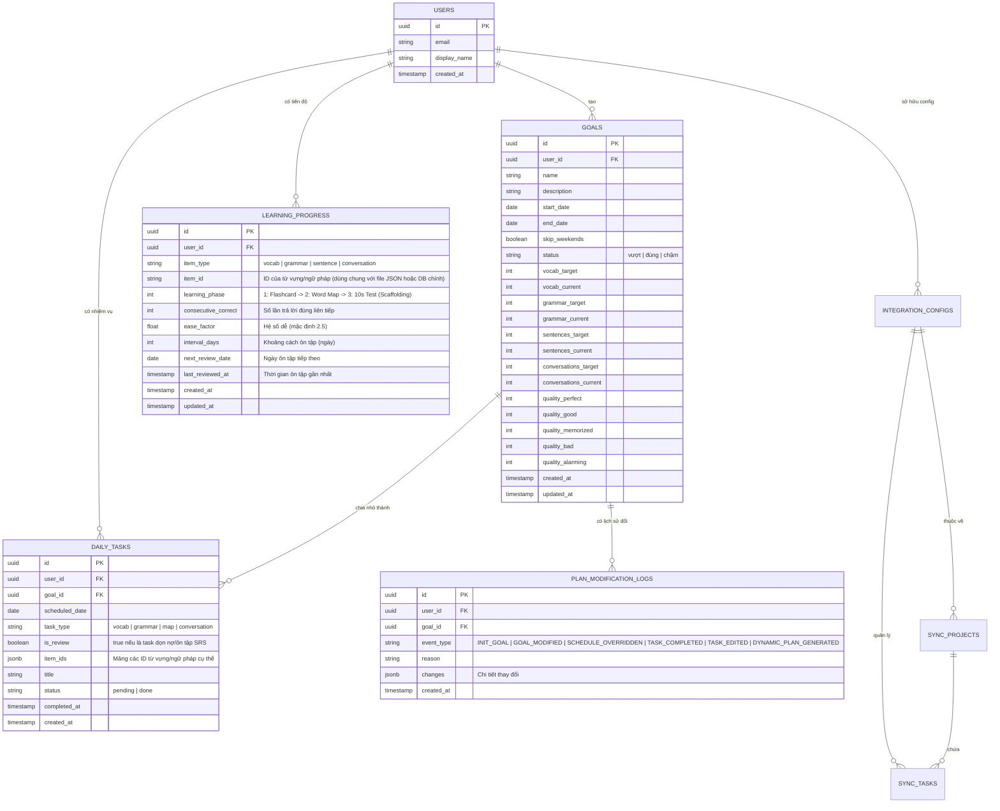

# 🗄️ Database Schema cho Japanese Learner (PostgreSQL)

Dưới đây là thiết kế Schema cho hệ thống cơ sở dữ liệu PostgreSQL nhằm lưu trữ toàn bộ dữ liệu của người dùng, bao gồm thông tin mục tiêu, tiến độ học tập (Spaced Repetition) và các nhiệm vụ hằng ngày.

## 1. Sơ đồ Quan hệ (Entity-Relationship Diagram)

---

## 2. Chi tiết các Bảng (Tables)

### Bảng `users`
Lưu trữ thông tin định danh của người dùng.
- `id` (UUID, Primary Key)
- `email` (VARCHAR, Unique)
- `display_name` (VARCHAR)
- `created_at` (TIMESTAMP)

### Bảng `goals` (Mục tiêu học tập)
Lưu trữ các chiến dịch/mục tiêu đan xen mà người dùng đã thiết lập.
- `id` (UUID, Primary Key)
- `user_id` (UUID, Foreign Key -> `users.id`)
- `name` (VARCHAR): Tên chiến dịch (VD: N3 Giao tiếp 3 tháng)
- `description` (TEXT): Mô tả mục tiêu
- `start_date` (DATE)
- `end_date` (DATE)
- `skip_weekends` (BOOLEAN): Tùy chọn nghỉ thứ 7, CN.
- `status` (VARCHAR): `vượt`, `đúng`, `chậm`
- **Workload Tracking** (Khối lượng công việc):
  - `vocab_target`, `vocab_current` (INT)
  - `grammar_target`, `grammar_current` (INT)
  - `sentences_target`, `sentences_current` (INT)
  - `conversations_target`, `conversations_current` (INT)
- **Quality Tracking** (Độ chín kiến thức):
  - `quality_perfect`, `quality_good`, `quality_memorized`, `quality_bad`, `quality_alarming` (INT) - *Tỷ lệ % hoặc số lượng.*
- `created_at`, `updated_at` (TIMESTAMP)

### Bảng `daily_tasks` (Nhiệm vụ hàng ngày)
Thuật toán Auto-breakdown sẽ sinh ra các dòng dữ liệu trong bảng này để quản lý Kế hoạch Hôm nay của người dùng.
- `id` (UUID, Primary Key)
- `user_id` (UUID, Foreign Key -> `users.id`)
- `goal_id` (UUID, Foreign Key -> `goals.id`): Thuộc chiến dịch nào.
- `scheduled_date` (DATE): Ngày làm nhiệm vụ.
- `task_type` (VARCHAR): `vocab`, `grammar`, `map`, `conversation`
- `is_review` (BOOLEAN): `true` nếu là task sinh ra bởi thuật toán SRS (ôn tập/dọn nợ cũ). `false` nếu là task học kiến thức mới (Auto-breakdown).
- `item_ids` (JSONB): Mảng chứa danh sách các ID từ vựng/ngữ pháp cụ thể sẽ phải học trong task này.
- `title` (VARCHAR): Tiêu đề hiển thị (VD: Luyện 15 Từ Vựng Mới)
- `status` (VARCHAR): `pending`, `done`
- `completed_at` (TIMESTAMP)
- `created_at` (TIMESTAMP)

### Bảng `learning_progress` (Tiến độ học SRS)
Đây là bảng cốt lõi giúp hệ thống biết được từ nào người dùng đã thuộc, từ nào hay quên để đưa vào lịch ôn tập. Dữ liệu từ vựng gốc (`vocabulary.json`) vẫn có thể giữ nguyên làm Master Data, bảng này chỉ lưu **Trạng thái cá nhân** của người dùng lên các từ đó.
- `id` (UUID, Primary Key)
- `user_id` (UUID, Foreign Key -> `users.id`)
- `item_type` (VARCHAR): Loại kiến thức (`vocab`, `grammar`, `sentence`, `conversation`)
- `item_id` (VARCHAR): ID của từ vựng/ngữ pháp (Tham chiếu sang `vocabulary.json` hoặc DB gốc)
- `learning_phase` (INT): Phục vụ phương pháp **Scaffolding (Giàn giáo)**. `1`: Đang học Flashcard -> `2`: Đã chuyển sang luyện Word Map -> `3`: Đã nâng cấp lên Test 10s.
- `consecutive_correct` (INT): Chuỗi đúng liên tiếp.
- `ease_factor` (FLOAT): Độ khó dễ của từ đối với user (Thuật toán SuperMemo 2).
- `interval_days` (INT): Khoảng thời gian tới lần ôn tập sau (1, 3, 5, 7, 15...).
- `next_review_date` (DATE): Ngày cần lôi ra học lại.
- `last_reviewed_at` (TIMESTAMP)
- `created_at`, `updated_at` (TIMESTAMP)

### Bảng `plan_modification_logs` (Lịch sử hoạt động & Thay đổi)
Bảng này dùng để audit (lưu vết) mọi hành động của người dùng liên quan đến Goal và Task. Bất kỳ sự xê dịch nào về kế hoạch học tập hay hoàn thành task đều được ghi nhận tại đây.
- `id` (UUID, Primary Key)
- `user_id` (UUID, Foreign Key -> `users.id`)
- `goal_id` (UUID, Foreign Key -> `goals.id`): Thuộc chiến dịch nào.
- `event_type` (VARCHAR): Loại sự kiện (`INIT_GOAL`, `GOAL_MODIFIED`, `SCHEDULE_OVERRIDDEN`, `TASK_COMPLETED`, `TASK_EDITED`, `DYNAMIC_PLAN_GENERATED`).
- `reason` (TEXT, Nullable): Lý do người dùng đưa ra khi thay đổi lịch (bắt buộc phải ghi lý do nếu đổi lịch).
- `changes` (JSONB): Lưu data object mô tả trạng thái trước/sau của sự thay đổi (Ví dụ: `{ previousStatus: 'pending', newStatus: 'done' }`).
- `created_at` (TIMESTAMP)

### Bảng `integration_configs` (Cấu hình tích hợp Backlog/Jira)
Lưu thông tin API Key và cài đặt dành cho Dev Task Terminal để đồng bộ với bên thứ 3.
- `id` (UUID, Primary Key)
- `user_id` (UUID, Nullable, Foreign Key -> `users.id`)
- `platform` (VARCHAR): Hệ thống sử dụng (`BACKLOG`, `JIRA`, `GITHUB`)
- `domain` (VARCHAR): Domain của workspace (VD: `sanshinbts.backlog.com`)
- `api_key` (VARCHAR): API Token/Key để fetch data.
- `is_active` (BOOLEAN): Trạng thái hoạt động của kết nối này.

### Bảng `sync_projects` (Các dự án đã đồng bộ)
Lưu lại danh sách Project để lúc User gõ tạo Task mới có dropdown chọn Project tương ứng.
- `id` (UUID, Primary Key)
- `config_id` (UUID, Foreign Key -> `integration_configs.id`)
- `project_key` (VARCHAR): Ký hiệu project (VD: `XAI_SHINKO`)
- `name` (VARCHAR): Tên dự án.

### Bảng `sync_tasks` (Bộ nhớ đệm Task từ bên thứ 3)
Lưu trữ (Cache) lại toàn bộ danh sách Task được lấy về từ hệ thống của cty để hiển thị mượt mà không bị trễ do mạng.
- `id` (UUID, Primary Key)
- `user_id` (UUID, Nullable)
- `config_id` (UUID, Foreign Key)
- `project_id` (UUID, Nullable, Foreign Key)
- `external_id` (VARCHAR): ID nội bộ của Nulab Backlog.
- `issue_key` (VARCHAR): Mã hiển thị (VD: `XAI_SHINKO-47`).
- `title` (VARCHAR)
- `description` (TEXT)
- `priority` (VARCHAR): Mức độ ưu tiên chuẩn hóa (`P0`, `P1`, `P2`, `P3`)
- `status` (VARCHAR): Trạng thái chuẩn hóa (`TODO`, `IN_PROGRESS`, `DONE`)
- `url` (VARCHAR): Link direct tới ticket.
- `issue_type` (VARCHAR): (Bổ sung khi fetch thực tế).
- `assignee_name` (VARCHAR): (Bổ sung khi fetch thực tế).
- `last_synced_at` (TIMESTAMP)

---

## 3. Kiến trúc Đề xuất (Stack)
Với Next.js, chúng ta có thể sử dụng các công cụ sau để thao tác với PostgreSQL một cách an toàn và mạnh mẽ nhất:
1. **ORM:** **Prisma** hoặc **Drizzle ORM** (Tôi đề xuất dùng Prisma vì dễ cài đặt Schema).
2. **Database:** Supabase, Neon hoặc chạy Postgres local/Docker.
